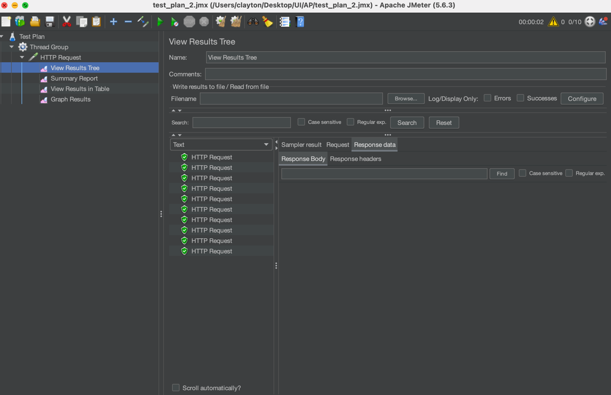
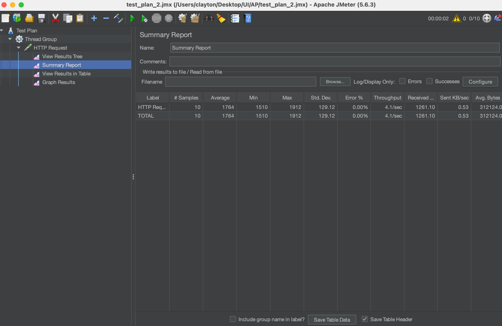
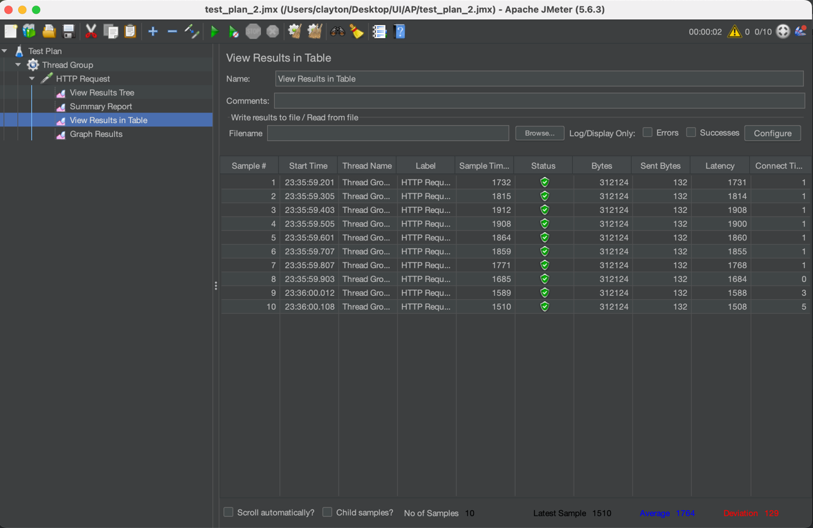
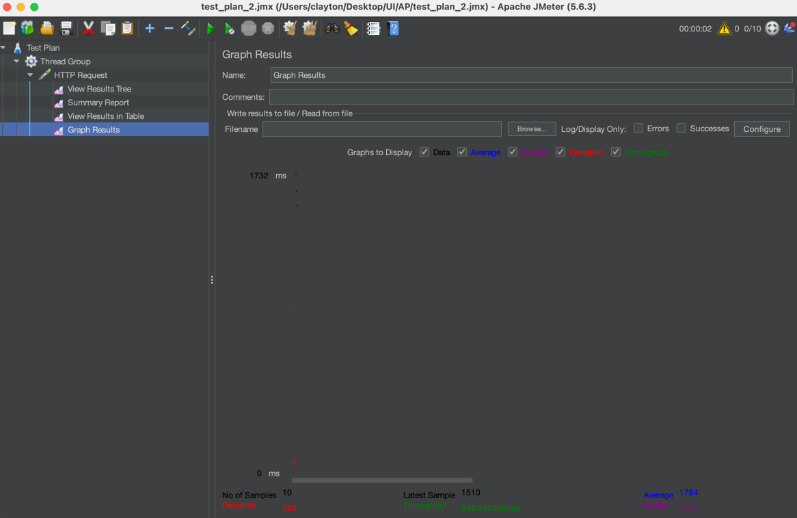
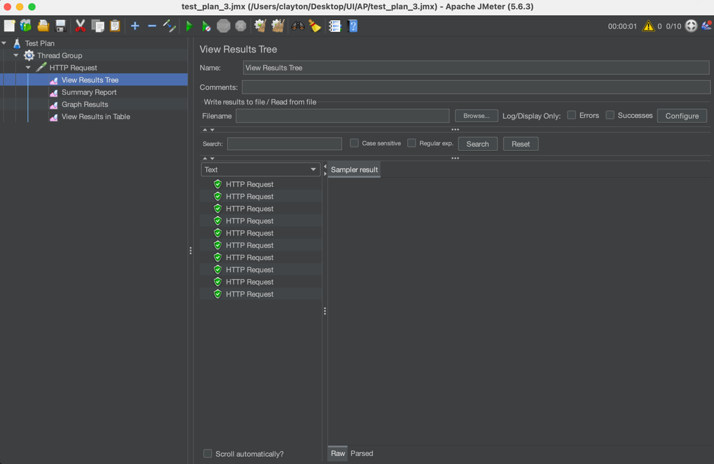
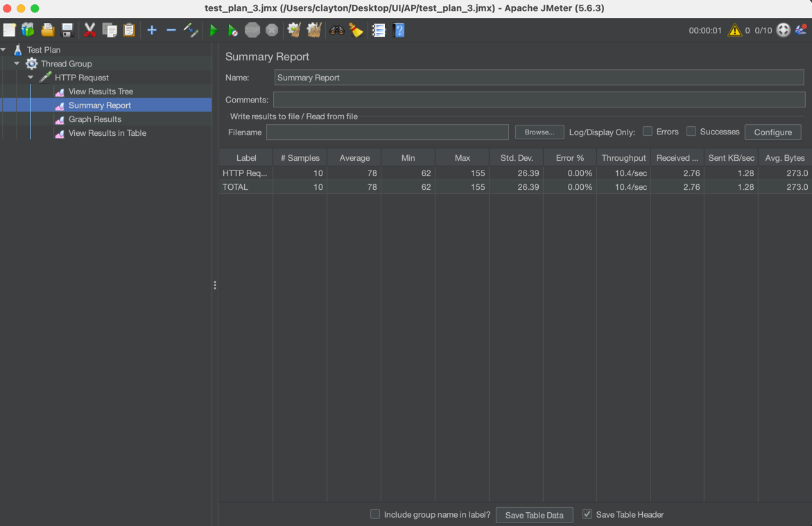
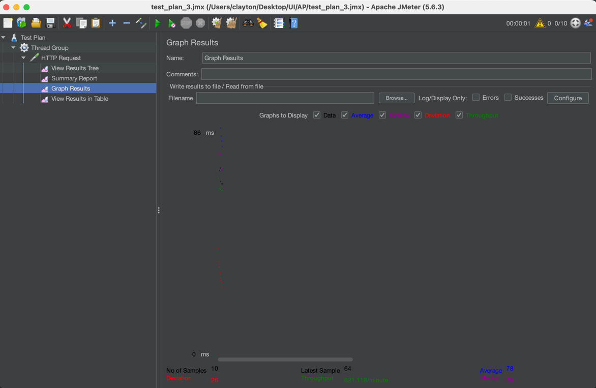
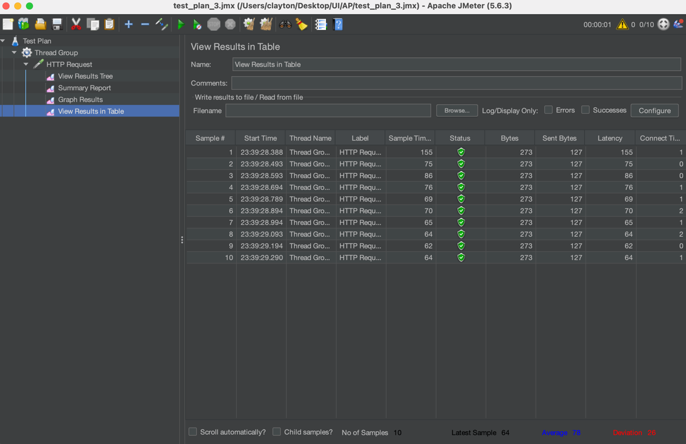
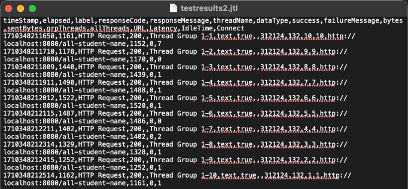
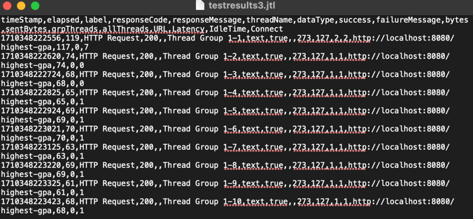

Module 5
/all-student-name

/highest-gpa

/all-student-name command line

/highest-gpa command line

Conclusion:
In the second measurement using JMeter, there were dramatic improvements in the running time. Each end point was largely more efficient and had at least a 20% improvement.

Reflection:
1. Jmeter is designed to simulate user behavior and measures performance under different loads and conditions. This is done through test plans that are created for to test different scenarios. In the context of optimizing application performance, Jmeter helps identify performance issues by analyzing how the system handles under load and whether performance requirements are met. IntelliJ profiler analyzes the runtime behavior of Java applications. When the application is run, the profiler collects runtime data, CPU usage, memory allocation, and method execution. In the context of optimizing application performance, IntelliJ profiler pinpoints parts of code that take up excessive resources.
2. The profiling process helps identify weak points in applications by analyzing performance bottlenecks, hotspots in code, memory leaks, and thread activity.
3. IntelliJ profiler is effective in assisting the analysis and identification of bottlenecks in application code by offering real time data and visualizations. Furthermore, it's integrated with the IntelliJ Idea software, making it easy to integrate into a workflow.
4. The main challenges faced when conduction performance testing and profiling are setting up a realistic test environment, managing large datasets, and overhead. To overcome these challenges, we can use automated environments and common practices, analyzing data before we use it, and using efficient and optimized tests for our application.
5. IntelliJ profiler provides us with information about runtime behavior of our applications, by identifying performance issues. Because of its integration with IntelliJ idea, real-time data analysis, visualizations, memory leak detection, IntelliJ profiler is great tool for profiling our application's code.
6. Situations where the results from profiling with IntelliJ Profiler are not entirely consistent with findings from performance testing using JMeter can be handled by finding correlations between the data and adjusting test cases.
7. Strategies we can implement in optimizing application code after analyzing results from performance testing and profiling are addressing the issues we analyzed, optimizing our data structures and algorithms, optimize resource usage, and refactoring. To ensure the changes we make do not affect the application's functionality, we use testing such as unit tests and functional tests. 